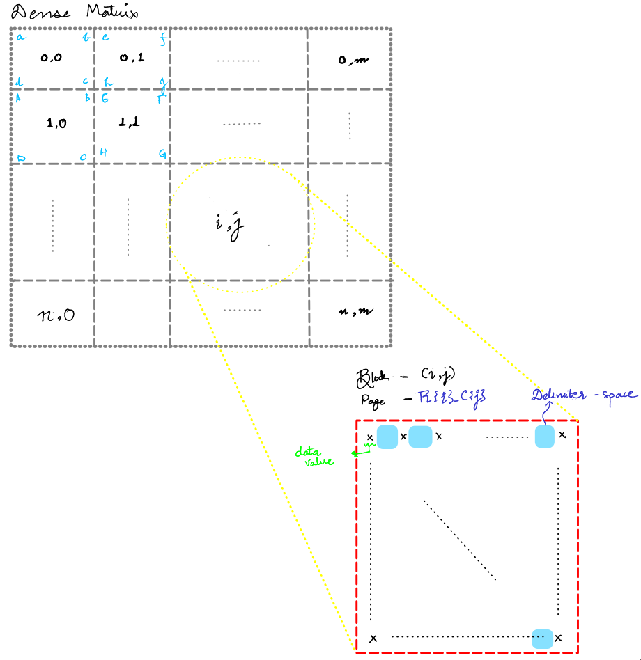
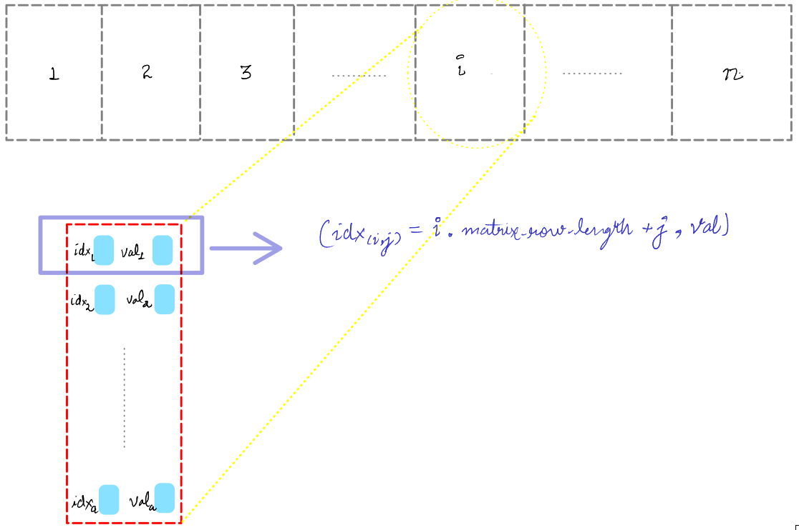

# Matrix

> Kindly refer to the PDF version of the same for rendering the equations.

## Page Layout

### Dense Matrix
- The matrix is divided into *2-D* **blocks/pages** of submatrices of size $40 \times 40$.
- In the corresponding page, we store the *values* of elements at corresponding indices according to the original matrix.

### Sparse Matrix
- Elements are stored in a page in  **row-major order**  as a *tuple* $(hashed\ index, value)$ where $hashed\ index = i \times matrix\ row\ length + j$ for value at position $(i, j)$ in the given matrix.
- The matrix is divided into pages of size $800$.

## Compression Ratio for Sparse Matrices

Consider a *2-D **sparse** matrix* of **dimensions** $(n, m)$  with density $d$, where *density*: percentage of matrix containing non-zero values.

> We were given that the *page-size* and the *block-size* for **Phase 0** are equal to $8092 B = 8KB$. 

- Storage space used (when stored as a *dense* matrix) 
	$$\begin{align}
	b &= \#pages \times \textit{page-size} 
	\\ &= \left \lceil{\frac {n \times m} {1600}}\right \rceil \times 8 KB
	\end{align}$$ 
	
- Storage space used (when stored as a *sparse* matrix) 
	$$\begin{align}
 	a &= \#pages \times \textit{page-size} 
	\\ &= \left \lceil{\frac {d \times n \times m} {800}}\right \rceil \times 8KB
 \end{align}$$

---

$$\begin{align} 
	\textit{Compression Ratio } &= {\frac b a}\\ &= {\frac {\left \lceil{\frac {n \times m} {1600}}\right \rceil} {\left \lceil{\frac {d \times n \times m} {800}}\right \rceil }} \\ 
	&\approx {\frac 1 {2\times d}} \quad \quad \left(\textit{when }m\times n >> 0\right)
\end{align}$$

---

## In-Place Transposition

### Dense Matrix
- **Load matrix** from disk.
- For **pages** with **page index** $(i, i)$,
	- **Load** page into the buffer.
	- **In-place transpose** the *sub-matrix* contained in page.
	- **Update** the disk block corresponding to the page.
- For **complementary pages** with **page indices** $(i, j)$ and $(j, i)$,
	- **Load** the pages into the buffer.
	- **Pad** *sub-matrices* in the pages with $0$s (in required dimension) to the square matrix.
	- **In-place transpose** the *sub-matrices* in buffer.
	- **Shrink** the matrices according to the dimensions of transpose of matrices. 
	- **Write** the *transposed matrix* correspoding to *page* $(i, j)$ in *disk-block* $(j, i)$ and vice-versa.  

---

### Sparse Matrix
- **Load matrix** from disk.
- For every **page** corresponding to the matrix,
	- **Load page** into the buffer.
	-  For each *element* i.e. the tuple $(hashed\ index, value)$ ,
		-  **Extract** the $(i, j)$ **index** from *hashed index*, where $i = \textit{hashed index}/\textit{matrix row-size}$ and $j = \textit{hashed index}\mod\textit{matrix row-size}$.
		-  **Replace** it with ***hashed index*** of $(j, i)$ i.e. $\textit{new hashed index}  = j * \textit{matrix column size} + i$.
	- **Update disk block** corresponding to the page.